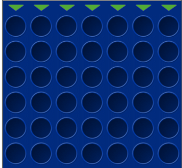

= 4 Gewinnt

== Allgemein
Es soll ein klassisches 4 Gewinnt Spiel aufgebaut werden um dieses mit 2 Spielern bis zu einem Sieg oder einem Unentschieden zu spielen.
Optional:	- 1 Spieler Variante mit KI

== Spielfeld
Das Spielfeld soll ein klassisches Spielfeld mit den Maßen 7x6 (7 Breit und 6 Hoch) sein. Über dem Spielfeld sollen sich Buttons (hier grüne Pfeile) befinden, womit man angeben kann wohin man sein Spielstein befördern will. Falls eine Spalte voll ist, soll der Button dieser Spalte verschwinden.
Optional:	- ein Scoreboard falls mehrere Spiele hintereinander gespielt werden

== Regeln
Es sollen abwechselnd rote und gelbe Spielsteine, von 2 unterschiedlichen Spielern, in dem Spielfeld platziert. Man wählt eine Spalte, wobei der Spielstein im untersten freien Feld der Spalte platziert werden. Es Gewinnt der Spieler, welcher 4 aufeinanderfolgende Spielsteine horizontal (----), vertikal (|) oder diagonal (/ oder \) zu platzieren.

== Animationen
Der als letzter hinzugefügter Spielstein soll eine spezielle Animation haben, damit dieser von dem anderen Spieler direkt erkannt wird. Die restlichen Spielsteine sollen ruhig stehen.
Optional: 	- Das herunterfallen eines Spielsteines beim Einwurf ist nicht direkt benötigt, kann bei Gelegenheit aber implementiert werden.

== Inspiration
https://www.4-gewinnt.de/mittel.html